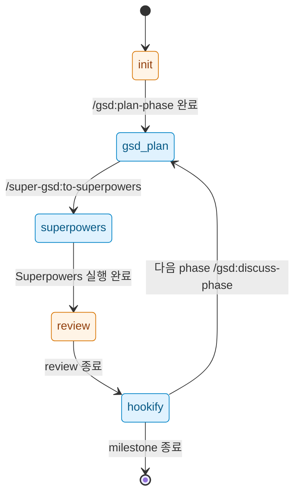

# Phase 2: Manual Handoff & Status - Context

**Gathered:** 2026-05-15
**Status:** Ready for planning

<domain>
## Phase Boundary

Phase 2는 세 가지 산출물 묶음을 만든다.

1. `commands/to-superpowers.md` — 슬래시 명령 `/super-gsd:to-superpowers [phase]`
2. `commands/status.md` — 슬래시 명령 `/super-gsd:status`
3. `.planning/HANDOFF.md` — append-only 상태 추적 마크다운 파일 (이 phase에서 처음 생성)

**In scope (HAND-01~04, STATE-01~02):**
- 두 슬래시 명령 본문 작성 (실행 가능한 markdown + frontmatter)
- HANDOFF.md 스키마 정의 및 초기 파일 작성
- 두 명령이 HANDOFF.md를 읽고/쓰는 로직 명시

**Out of scope (Phase 2):**
- `Stop`/`SubagentStop` 자동 hook 등록 (Phase 3 영역)
- Hookify 결과를 `.planning/lessons/`로 자동 적재 (Phase 4 영역)
- 명령 자체에 대한 자동 테스트 인프라 (v2 이후)

</domain>

<flow>
## 핸드오프 트랜잭션 흐름

`/super-gsd:to-superpowers`가 호출되면 다음 순서로 동작한다.

```
사용자 입력 → phase 인자 해석(없으면 STATE.md에서 추출)
            → PLAN.md/REQUIREMENTS.md/ROADMAP 메타 수집
            → 단일 구조화 프롬프트 빌드 (phase meta + goal + SC + REQ-ID + PLAN 전문)
            → HANDOFF.md에 (phase, to) 멱등성 키 검사
                          ↓ 이미 존재
                       skip append (중복 방지 — SC3)
                          ↓ 신규
                       row append + 프롬프트 표시
                          ↓
            → Skill tool로 `superpowers:executing-plans` invoke
```

## Stage 전이 상태 머신

`/super-gsd:status`가 HANDOFF.md 마지막 row의 `to` 컬럼을 읽어 stage를 판정하고, 아래 상태 머신에 따라 다음 명령을 권장한다.



각 상태에서의 "다음 권장 명령" 매핑은 D-28 표 참조.

</flow>

<decisions>
## Implementation Decisions

### 명령 디렉토리 구조 & 등록 방식
- **D-16:** 명령 소스 파일은 root의 `commands/` 디렉토리에 flat 배치 — `commands/to-superpowers.md`, `commands/status.md`. plugin.json의 `name: "super-gsd"`가 자동으로 namespace prefix가 되어 `/super-gsd:to-superpowers`, `/super-gsd:status`로 노출된다. plugin.json에 명시적 `commands` 배열 등록 불필요.
- **D-17:** 명령 파일 frontmatter 표준 세트 — `name`, `description`(한 줄, `/help` 노출용), `argument-hint`(인자 설명). `allowed-tools`는 미명시 (두 명령 모두 Read·Write·Bash·Skill 사용 필요).
  - `to-superpowers`: `argument-hint: "[phase] - optional. Defaults to STATE.md current phase"`
  - `status`: argument-hint 없음 (인자 없는 명령)
- **D-18:** 본문은 GSD 명령 구조 모방 — `<objective>` / `<execution_context>` / `<process>` / `<success_criteria>` XML 섹션. GSD/Superpowers/Hookify 관례와 일관성 유지. `<execution_context>`에 외부 워크플로 파일 참조는 두지 않음(super-gsd는 자체 단순 워크플로).

### `to-superpowers` 동작 형태
- **D-19:** 하이브리드 — 명령은 (a) 구조화된 핸드오프 프롬프트를 사용자 출력으로 표시하고, (b) 이어서 Skill tool로 `superpowers:executing-plans`을 자동 invoke한다. 사용자 입력 없이 한 번에 진행. 프롬프트 본문이 보이므로 디버깅·복사·재사용 가능.
- **D-20:** Skill은 `superpowers:executing-plans` 고정. `subagent-driven-development`는 v2 옵션으로 deferred.
- **D-21:** 프롬프트 표준 구성(단일 markdown blob, 외부 파일 의존 없음):
  - Phase 번호 + 이름 + goal (ROADMAP.md `roadmap.get-phase`에서 추출)
  - Success Criteria 목록 (ROADMAP.md)
  - REQ-ID + 각 REQ의 1줄 정의 (REQUIREMENTS.md에서 grep)
  - 해당 phase의 모든 PLAN.md 본문 (fenced code block으로 인라인)

### HANDOFF.md 스키마 & 멱등성 키
- **D-22:** Markdown table 형식, append-only. 헤더 1줄 + 헤더 구분선 + 데이터 행. STATE-02 "사람이 읽을 수 있는 마크다운" 조건 만족.
- **D-23:** 열 5개 — `Timestamp | Phase | From | To | Plan Hash`. `Plan Hash`는 해당 phase의 모든 PLAN.md 본문을 합친 후 sha256 short(7자)로 산출.
- **D-24:** 멱등성 키 = `(Phase, To)` 조합. 같은 phase에 같은 to-stage로 재실행하면 row append 없이 skip하고 사용자에게 "already handed off" 메시지 출력. Plan Hash가 다르면 (PLAN.md가 변경됨) 신규 row append 허용.
- **D-25:** Stage 값 enum(`From`/`To` 컬럼) — `init` | `gsd-plan` | `superpowers` | `review` | `hookify`. ROADMAP success criterion 4의 "plan/execute/review/hookify"와의 명칭 조정: "execute" 대신 도구 이름인 "superpowers"를 그대로 사용해 stage 추론을 명확히.
- **D-26:** Timestamp는 ISO 8601 UTC 형식 (`2026-05-15T11:23:45Z`). 초기 HANDOFF.md는 헤더+구분선만 있는 빈 table; `init` row를 사전 작성하지 않음 (첫 핸드오프가 첫 row).

### `status` stage detection & 다음 명령 매핑
- **D-27:** Stage 판정 = HANDOFF.md 마지막 row의 `To` 컬럼. HANDOFF.md가 비어 있거나 헤더만 있으면 stage = `init`. STATE.md는 부가 정보(현재 phase 번호·이름)로만 참조, stage 추론에는 사용하지 않음.
- **D-28:** Stage → 다음 권장 명령 매핑 (변환 테이블):

  | 현재 Stage | 다음 권장 명령 |
  |-----------|--------------|
  | `init` | `/gsd:plan-phase {current_phase}` |
  | `gsd-plan` | `/super-gsd:to-superpowers` |
  | `superpowers` | `/hookify` |
  | `review` | `/hookify` |
  | `hookify` | `/gsd:discuss-phase {next_phase}` (다음 phase 번호는 ROADMAP에서 +1, 마지막 phase면 `/gsd:complete-milestone`) |

- **D-29:** `/super-gsd:status` 출력 = 3줄 요약 + 1줄 다음 명령 + 빈 줄(가독성). 예시:
  ```
  Phase: 1 (Plugin Scaffold)
  Stage: superpowers
  Last handoff: 2026-05-15T11:23:45Z

  Next: /hookify
  ```
  `--json` 같은 추가 옵션은 v2로 deferred.

### Phase 1에서 carry forward (재질문 불필요)
- **D-01 (carry):** `commands/` 디렉토리를 이번 phase에서 처음 생성. 다른 subdir(`hooks/`, `skills/`)는 여전히 생성하지 않음.
- **D-02 (carry):** Phase 2 종료 시 plugin.json `version: 0.0.1` → `0.0.2`로 patch bump. CHANGELOG.md에 `[0.0.2]` entry 추가.
- **D-14 (carry):** 비침투적 원칙 — GSD/Superpowers/Hookify 자체 파일은 수정하지 않음. `Skill` 호출은 Claude Code 표준 API이므로 invasive 아님.
- **D-15 (carry):** `.planning/HANDOFF.md`는 이번 phase에서 최초 생성. 빈 table로 시작.

### Claude's Discretion
- 슬래시 명령 본문 안의 정확한 Bash 명령 시퀀스 (예: PLAN.md 발견용 `ls` 패턴, sha256 계산 방식 `sha256sum` vs `shasum -a 256`)
- D-21 프롬프트의 인라인 PLAN.md 구분자 스타일 (헤더 형태, 다중 plan이면 plan id 라벨 등)
- 명령이 출력하는 사용자 메시지 톤(영문/한글 — 본문은 D-30 따라 한글)
- 초기 HANDOFF.md 헤더 위 짧은 설명 줄을 둘지 여부 (예: "Append-only handoff log. Read by /super-gsd:status." 한 줄)

### 추가 결정 (외부 영향)
- **D-30:** `commands/*.md` 본문 안의 사용자 노출 문자열(에러/도움말/상태)은 영문으로 유지한다. 명령은 OSS 사용자 노출 surface(README와 같은 면)이며, Korean-only 정책은 `.planning/` 내부 산출물에 한정한다. CLAUDE.md `GSD 문서 작성 지침`은 `.planning/` 문서에 적용되며 `commands/`는 사용자 surface로 분류한다.

</decisions>

<canonical_refs>
## Canonical References

**Downstream agents MUST read these before planning or implementing.**

### Project-level
- `.planning/PROJECT.md` — Constraints (비침투적, idempotency), Key Decisions
- `.planning/REQUIREMENTS.md` §"Handoff Commands (HAND)" — HAND-01/02/03/04
- `.planning/REQUIREMENTS.md` §"State & Status (STATE)" — STATE-01/02
- `.planning/ROADMAP.md` §"Phase 2: Manual Handoff & Status" — 4가지 success criteria
- `.planning/STATE.md` — phase 자동 추출(HAND-02) 대상 파일

### 이전 phase 산출물 (Phase 2가 위에 쌓는 베이스)
- `.planning/phases/01-plugin-scaffold/01-CONTEXT.md` — Phase 1 결정 D-01..D-15
- `.claude-plugin/plugin.json` — `name: "super-gsd"` (slash namespace prefix 소스)
- `.claude-plugin/marketplace.json` — 이번 phase에서 변경하지 않지만 일관성 확인용
- `README.md` Roadmap 섹션 — Phase 2가 추가하는 명령 이름이 이미 사용자에게 약속됨

### Claude Code 외부 문서 (researcher가 plan 작성 전 확인)
- Claude Code 슬래시 명령 시스템 — `commands/{name}.md` 자동 발견, frontmatter 스키마(name/description/argument-hint/allowed-tools), `$ARGUMENTS` 인자 전달 방식. [Medium — 공식 docs 또는 Context7 확인]
- Skill tool 시그니처 — `Skill(skill="superpowers:executing-plans", args="...")` 호출 방식 확인.

### Superpowers 의존 (read-only 참조)
- `superpowers:executing-plans` 스킬 — Skill 입력 형식, expected 입력 구조 확인
- `superpowers:subagent-driven-development` — 이번 phase에선 invoke 안 하지만 향후 옵션 인지

</canonical_refs>

<code_context>
## Existing Code Insights

### Reusable Assets
- `.claude-plugin/plugin.json` 의 `name`, `version`, `description` 필드 — 두 명령이 모두 자기 정체성 메시지(예: status 헤더)에 노출 가능
- `.planning/STATE.md` 의 frontmatter `progress.current_phase` 또는 본문 `## Current Position` — phase 자동 추출(HAND-02) 데이터 원천
- `.planning/ROADMAP.md` 의 Phase 섹션 헤더 — `roadmap.get-phase` SDK 쿼리로 정형 추출 가능. 명령에서 SDK 사용 가능 여부 확인 필요 (사용 가능하면 grep 대신 SDK 권장).

### Established Patterns
- GSD 명령 (`.claude/skills/gsd-*`)이 사용하는 `<objective>/<execution_context>/<process>/<success_criteria>` XML 패턴 — D-18에서 모방
- ISO 8601 UTC timestamp는 STATE.md `last_updated`에서 이미 사용 중 — 일관성 유지
- GSD가 `.planning/STATE.md`를 frontmatter+본문 혼합 마크다운으로 관리 — HANDOFF.md는 동일 디렉토리에 위치하되 형식은 더 단순(table)

### Integration Points
- `/super-gsd:to-superpowers` 출력의 Skill 호출 부분이 Claude Code의 Skill tool API 의존. 형식 불일치 시 invoke 실패. researcher가 정확한 시그니처 확인 필수.
- `HANDOFF.md` 의 멱등성 검사(D-24)는 phase 인자가 있는 호출과 없는 호출(STATE.md 추출) 양쪽에서 동작해야 함. 추출 후 정규화 단계가 명령 안에 있어야 함.
- Phase 3 (Auto-Advance Hooks)이 동일 HANDOFF.md를 자동으로 append할 예정 — 스키마가 hook에서도 동일하게 쓰여야 하므로 D-22~D-26의 형식이 단순·견고해야 함.

</code_context>

<specifics>
## Specific Ideas

- Plan Hash 계산: `(cat .planning/phases/<phase-dir>/*-PLAN.md | sha256sum | cut -c1-7)` 형태. 빈 phase 디렉토리면 hash = `"nodata"` 같은 sentinel.
- `to-superpowers` 멱등성 메시지 톤(영문, OSS surface):
  > `Already handed off Phase 1 to superpowers at 2026-05-15T11:23:45Z (plan hash matches). Skipping append. Use /super-gsd:status to inspect, or modify a PLAN.md to re-handoff.`
- `status` 의 다음 phase 계산(D-28의 `hookify → /gsd:discuss-phase {next_phase}`): ROADMAP.md 현재 phase 번호 +1, 그 phase가 ROADMAP에 존재하지 않으면 `/gsd:complete-milestone` 권장.
- HANDOFF.md 헤더 위 1줄 설명 권장(Claude's Discretion에서 채택 시):
  > `<!-- Append-only handoff log. Format locked by .planning/phases/02-manual-handoff-status/02-CONTEXT.md (D-22..D-26). -->`

</specifics>

<deferred>
## Deferred Ideas

- `subagent-driven-development` 스킬을 옵션으로 호출 (`--skill <name>` 인자) — v2로 이월. 현재는 `executing-plans` 고정.
- `/super-gsd:status --json` 자동화/CI 친화 출력 — v2.
- HANDOFF.md frontmatter (schema_version 등) — 현재는 본문 헤더 1줄 주석으로 대체.
- `/super-gsd:status --watch` (1초 주기 갱신) — v2 이상.
- 외부 Linear/Jira 핸드오프 — PROJECT.md "Out of Scope" 명시, v2+ 별도 phase.

### Reviewed Todos (not folded)
없음 — `todo.match-phase` 매칭 0건.

</deferred>

---

*Phase: 2-Manual Handoff & Status*
*Context gathered: 2026-05-15*
